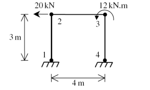

# This is the md readme file for ex01

Consider the plane frame shown in the figure. Given E = 210 GPa, A = 0.02 m2, and I = 5*10-5.

determine:
* Gloabal stiffness matrix
* All the displacements
* All the forces
* Internal force for each element

