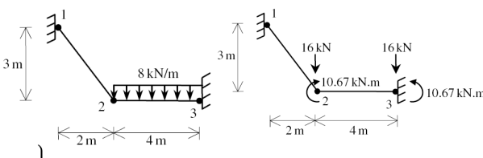

# This is the md file for ex02

Consider the plane frame shown below. Given E = 200GPa, A = 4 * 10 m2, and I = 1 * 10-6

Determine:
* Gloabal stiffness matrix
* All the displacements
* All the forces
* Internal force for each element

