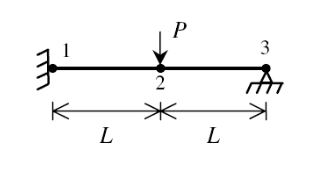

# This is the md readme file for ex03

Consider the plane frame shown in the figure. Given E = 210 GPa, A = 5 * 10-2, and I = 60 * 10-6.

P = 20KN

L = 2m

determine:
* Gloabal stiffness matrix
* All the displacements
* All the forces
* Internal force for each element

