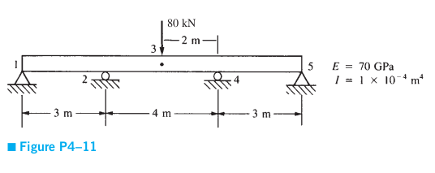

# This is the md readme file for ex05

This example is taken from Logan FEM book. Problem(4-11)

Consider the plane frame shown in the figure. Given E = 70 GPa, A = 5 * 10-2, and I = 1 * 10-4.

determine:
* Gloabal stiffness matrix
* All the displacements
* All the forces
* Internal force for each element

