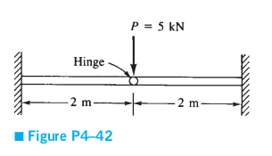

# This is the md readme file for ex06

This example is taken from Logan FEM book. Problem(4-42)

Consider the plane frame shown in the figure. Given E = 210 GPa, A = 5 * 10-2, and I = 2 * 10-4.

determine:
* Gloabal stiffness matrix
* All the displacements
* All the forces

